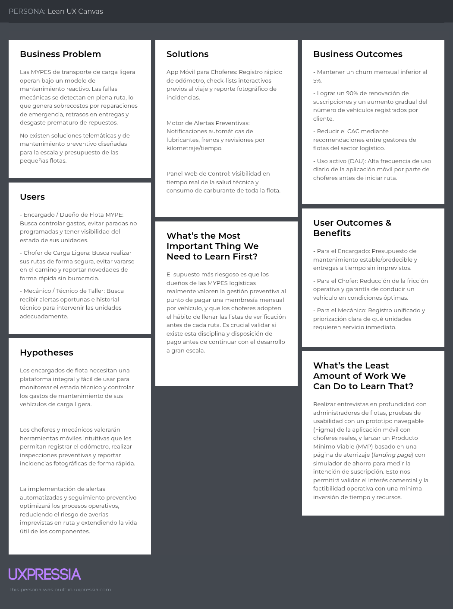

# Capítulo I: Introducción

## 1.1 Startup Profile

### 1.1.1 Descripción de la Startup

Telemtrix es una solución digital enfocada en la telemetría y la gestión preventiva del mantenimiento para vehículos de transporte de carga ligera. En las micro y pequeñas empresas del sector logístico, la condición técnica de los transportes se identifica habitualmente cuando surge un desperfecto en medio del servicio. En esa instancia, la corrección mecánica deja de ser una acción planificada y se transforma en un imprevisto operativo: incrementa los presupuestos respecto a una inspección a tiempo, posterga las entregas programadas y provoca el cambio de repuestos que hubiesen extendido su vida útil mediante un seguimiento adecuado. Telemtrix surge para anticiparse a estas averías, proporcionando un historial técnico unificado y detallado sobre el uso de cada unidad.

El servicio consiste en un software SaaS que integra la supervisión directa y la administración mecánica del parque automotor. A través de la aplicación móvil, los choferes y técnicos ingresan los datos del odómetro, adjuntan fotografías para documentar incidencias y llenan listas de verificación previas a cada trayecto. Con estos insumos, la herramienta emite notificaciones programadas para intervenciones como sustitución de lubricantes, inspección del sistema de frenado y repasos preventivos según la distancia recorrida o el periodo operativo. Desde el panel web de gestión, el encargado de la flota monitorea el rendimiento térmico y mecánico de los vehículos, efectúa el seguimiento del consumo de carburante y atiende las novedades en tiempo real. La modalidad comercial se basa en una membresía mensual fijada por unidad, convirtiendo los costos de taller en una partida contable estable y disminuyendo la probabilidad de fallas imprevistas en trayecto.

### 1.1.2 Perfiles de integrantes del equipo

| **Integrante** | **Santiago Israel Echevarria Lizana** |
|----------------|----------------------------------|
| **Código del Estudiante** | u20241g014 |
| **Carrera** | Ingeniería de Software |
| **Descripción** | Estudiante de Ingeniería de Software. Busca desarrollar nuevas habilidades y ampliar conocimiento en el área de desarrollo web, con conocimientos de C++, HTML, CSS. |
| **Foto** | |

---

## 1.2 Solution Profile

### 1.2.1 Antecedentes y problemática

- Who (¿Quién tiene el problema?): Las micro y pequeñas empresas (MYPES) del sector de transporte y logística de carga ligera, junto con sus conductores, técnicos y gestores de flota.

- What (¿Qué ocurre?): Desperfectos mecánicos imprevistos y fallas técnicas en plena ruta por falta de seguimiento preventivo del parque automotor.

- Where (¿Dónde ocurre?): Durante los recorridos de transporte en ruta y en la gestión operativa del taller/flota de las empresas logísticas.

- When (¿Cuándo sucede?): En medio del servicio de entrega, cuando no se detecta a tiempo el desgaste de componentes clave.

- Why (¿Por qué sucede?): Por la falta de un registro centralizado del uso del vehículo, la ausencia de listas de verificación rutinarias y la dependencia de un enfoque puramente correctivo en lugar de preventivo.

- How (¿Cómo impacta?): Paraliza las entregas programadas, acelera el desgaste prematuro de repuestos y sobrepasa los presupuestos operativos por reparaciones de emergencia.

- How Much (¿Cuánto cuesta/afecta?): Genera sobrecostos financieros significativos frente al costo de un mantenimiento planificado, además de pérdidas económicas directas por retrasos operativos e inoperatividad de las unidades.

### 1.2.2 Lean UX Process

#### 1.2.2.1. Lean UX Problem Statements

El estado actual de la logística de transporte de carga ligera para micro y pequeñas empresas (MYPES) se ha centrado principalmente en flujos de trabajo de mantenimiento reactivo, donde las fallas técnicas solo se identifican cuando ocurre una avería del vehículo en pleno servicio, dependiendo de controles informales y visitas no programadas al taller.

Lo que los productos/servicios existentes no logran resolver es una solución de gestión telemática y preventiva unificada y accesible para pequeñas operaciones, dejando un vacío entre los costosos software corporativos de flotas y la realidad operativa diaria de choferes y técnicos que carecen de herramientas sencillas para inspecciones previas al viaje y seguimiento del kilometraje.

Nuestro producto/servicio abordará este vacío mediante una solución SaaS que integra el reporte móvil directo (lecturas de odómetro, fotografías y listas de verificación previas al viaje realizadas por los choferes) con un panel web de gestión en tiempo real para automatizar alertas de mantenimiento preventivo (lubricantes, frenos, niveles térmicos) bajo un modelo de suscripción mensual predecible por vehículo.

Nuestro enfoque inicial será los propietarios, encargados de flota y choferes de MYPES de transporte de carga ligera que buscan eliminar reparaciones imprevistas y estabilizar sus costos operativos.

Sabremos que tenemos éxito cuando veamos una alta tasa de cumplimiento diario en la finalización de las listas de verificación por parte de los choferes, una reducción en los tiempos de inactividad no planificados de los vehículos en ruta y una adopción sostenida de las intervenciones de mantenimiento preventivo programadas en las unidades suscritas.

#### 1.2.2.2 Lean UX Assumption

### Business Assumptions
- Creemos que existe un mercado desatendido de MYPES de transporte de carga ligera dispuestas a pagar por un software de telemetría y mantenimiento si su costo es accesible y escalable.

- Creemos que un modelo de suscripción mensual basado en una tarifa fija por unidad vehicular generará ingresos recurrentes, predecibles y financieramente sostenibles para la empresa.

- Creemos que la propuesta de valor centrada en la reducción de costos por averías correctivas es el principal argumento de conversión para los tomadores de decisión logísticos.

- Creemos que la infraestructura en la nube y la arquitectura SaaS actual nos permiten desplegar la plataforma con costos de operación técnica reducidos.

- Creemos que la barrera de entrada de la competencia corporativa es alta para las MYPES debido a sus precios elevados y complejidad técnica, lo que nos otorga una ventaja competitiva en este segmento.

### Business Outcome Assumptions 
- Creemos que lograremos una tasa de retención mensual (churn rate menor al 5%) al demostrar un ahorro tangible en gastos de taller mecánico durante los primeros tres meses de uso.

- Creemos que reduciremos el Costo de Adquisición de Clientes a través de recomendaciones boca a boca entre administradores de flotas logísticas del mismo sector.

- Creemos que incrementaremos el valor de vida del cliente a medida que las empresas aumenten el número de unidades registradas en la plataforma.

- Creemos que alcanzaremos el punto de equilibrio operativo en los primeros 12 meses gracias a la baja fricción en la adopción del modelo SaaS por vehículo.

### User Assumptions (Supuestos del Usuario)
- Creemos que el encargado de flota / dueño de la MYPE busca visibilidad total sobre la condición técnica y consumo de carburante de sus unidades sin depender de reportes informales.

- Creemos que el chofer de carga ligera está dispuesto a usar una aplicación móvil rápida para registrar el odómetro y completar check-lists antes de iniciar su ruta.

- Creemos que el mecánico / técnico del taller prefiere recibir notificaciones preventivas y reportes con evidencia fotográfica antes de que los componentes sufran daños severos.

- Creemos que los usuarios del segmento MYPES poseen smartphones estándar y conocimientos digitales básicos suficientes para interactuar con la interfaz diariamente.

### User Outcome and Benefit Assumptions 

- Creemos que el encargado de flota logrará una planificación presupuestaria estable y evitará la paralización no programada de sus entregas.

- Creemos que el chofer experimentará trayectos más seguros y reducirá la fricción operativa al evitar vararse en ruta por fallas mecánicas imprevistas.

- Creemos que el mecánico optimizará sus tiempos de atención en taller al contar con un historial técnico unificado y detallado por unidad.

- Creemos que la empresa cliente incrementará la vida útil de sus repuestos y componentes clave mediante intervenciones técnicas a tiempo.

### Feature Assumptions 
- Creemos que la funcionalidad de Check-lists interactivos y subida de fotos en la app móvil garantizará la veracidad de las inspecciones previas al viaje.

- Creemos que el módulo de Alertas preventivas automatizadas (basadas en tiempo y kilometraje) asegurará el reemplazo oportuno de lubricantes y revisión de frenos.

- Creemos que un Panel web de control dinámico (Dashboard) permitirá al administrador visualizar la salud técnica de toda la flota en tiempo real sin requerir capacitación compleja.

- Creemos que el registro digital de Odómetro y seguimiento de consumo de carburante permitirá identificar anomalías de rendimiento térmico y mecánico por vehículo de forma temprana.

#### 1.2.2.3 Lean UX Hypothesis Statements

#### Hipótesis 1: Módulo de Check-lists e Incidencias Fotográficas

Creemos que lograremos una reducción en los tiempos de inactividad no planificados de los vehículos en ruta y una disminución en la tasa de cancelación de clientes (churn)

Si los encargados de flota y los choferes de transporte de carga ligera de las MYPES

Consiguen visibilidad operativa completa antes de cada viaje y un reporte de incidencias más rápido sin retrasar sus entregas

Con una lista de verificación móvil interactiva previa al viaje que incluye la subida rápida de fotografías y el registro del odómetro.

#### Hipótesis 2: Sistema de Alertas Preventivas Automatizadas

Creemos que lograremos un incremento en el valor de vida del cliente y la retención continua de las suscripciones

Si los encargados de flota y los mecánicos del taller

Consiguen la sustitución oportuna de componentes (lubricantes, frenos) extendiendo la vida útil de los repuestos y previniendo averías graves

Con un sistema automatizado de notificaciones de mantenimiento preventivo configurado según la distancia recorrida y el tiempo operativo acumulado.

#### Hipótesis 3: Panel Web de Gestión y Monitoreo de Flota 

Creemos que lograremos un menor Costo de Adquisición de Clientes gracias a recomendaciones boca a boca y una adopción de plataforma más rápida

Si los propietarios y administradores de logística de las MYPES

Consiguen presupuestos mensuales de mantenimiento predecibles y un control en tiempo real sobre la salud técnica global de sus unidades

Con un panel web centralizado de gestión que muestra el estado de la flota e indicadores de rendimiento térmico y mecánico en tiempo real.

#### Hipótesis 4: Módulo de Seguimiento de Odómetro y Carburante

Creemos que lograremos una mayor tasa de uso activo diario de la plataforma (DAU) y mejores tasas de renovación de contratos

Si los encargados de flota y los choferes

Consiguen la identificación temprana de consumos anómalos de combustible e ineficiencias mecánicas antes de que generen daños mayores

Con un módulo de registro digital de odómetro y seguimiento de consumo de carburante integrado en la aplicación móvil.

#### 1.2.2.4 Lean UX Canvas

## 1.3 Segmentos objetivos

### Segmento Objetivo 1: Encargados de Flota y Dueños de MYPES Logísticas

Este segmento representa las personas con capacidad de decisión de compra y pago de la suscripción SaaS de Telemtrix.

Perfil Demográfico y Geográfico:

- Cargo / Rol: Propietarios, gerentes de operaciones, administradores de logística o jefes de mantenimiento.

- Edad: 30 a 55 años.

- Ubicación: Zonas urbanas y periurbanas con alta densidad de distribución de mercancías y servicios de última milla.

- Nivel de Educación: Técnica o universitaria (Administración, Ingeniería Industrial, Logística o afines).

Características Operativas:

- Administran flotas compuestas por 2 a 15 vehículos de carga ligera (furgonetas, camionetas, motofurgones).

- Operan con márgenes ajustados donde cualquier gasto imprevisto de taller afecta directamente la rentabilidad mensual.

- Mantienen un control empírico o informal de los mantenimientos (cuadernos, hojas de cálculo en Excel o avisos verbales).

- Sustento Estadístico del Sector (MYPES, PYMEs, Transporte):

- Las micro y pequeñas empresas representan más del 95% del entramado empresarial en la región, concentrando una porción crítica del transporte urbano de mercancías.

- Estudios del sector logístico señalan que el mantenimiento correctivo imprevisto representa hasta un 20% a 30% más de costo frente a una rutina de inspección preventiva planificada.

- La falta de mantenimiento preventivo causa que hasta un 15% del tiempo operativo útil de las unidades ligeras se pierda en paradas no programadas por averías mecánicas.

### Segmento Objetivo 2: Choferes y Conductores de Carga Ligera

- Este segmento interactúa directamente con la aplicación móvil en el día a día operativo.

Perfil Demográfico:

- Cargo / Rol: Choferes repartidores, conductores de distribución local y transportistas de carga ligera.

- Edad: 21 a 50 años.

Nivel socioeconómico / Digital: Usuarios de smartphones gama media con conectividad a datos móviles, habituados al uso de apps de mensajería y navegación (WhatsApp, Waze, Google Maps).

Características Operativas:

- Cumplen jornadas intensas con múltiples paradas de entrega en ruta.

- Suelen percibir la documentación de incidencias como un proceso burocrático si requiere papeleo físico.

- Enfrentan el riesgo constante de quedar varados en ruta debido a fallas mecánicas no detectadas antes de salir.

Sustento Estadístico del Uso:

- La penetración de teléfonos inteligentes en trabajadores del sector transporte supera el 85%, lo que garantiza la viabilidad técnica del despliegue de una app móvil.

- El tiempo promedio que un conductor dispone para una inspección previa al viaje no supera los 3 a 5 minutos, respaldando la necesidad de check-lists digitales ágiles y con captura fotográfica.
