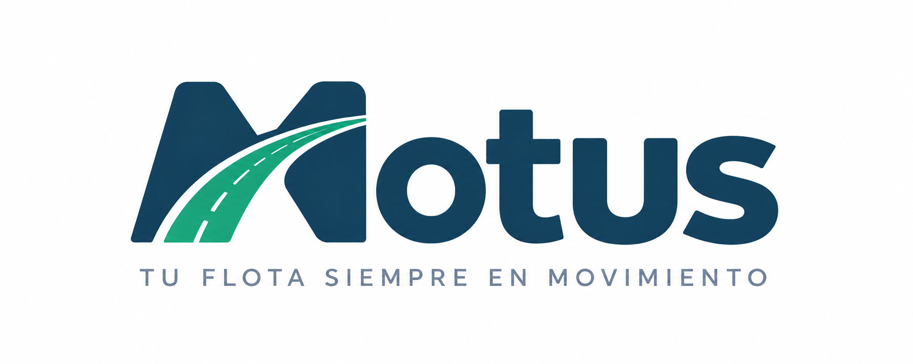
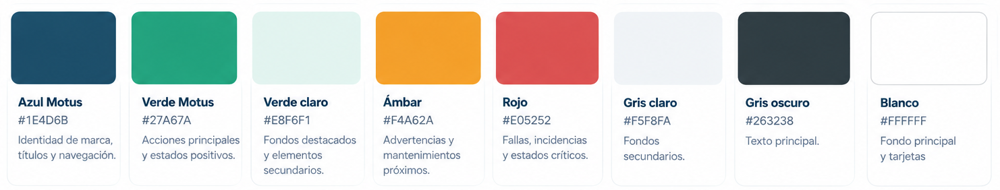

# Capítulo IV: Product Design
## 4.1. Style Guidelines

Las Style Guidelines de Motus establecen los lineamientos visuales y de comunicación que orientarán el diseño de la landing page y de la aplicación web. Estos lineamientos permiten mantener una identidad visual consistente y facilitar una experiencia clara para los dos principales tipos de usuario: los encargados de flota y los conductores de carga ligera.

La propuesta visual de Motus busca transmitir confianza, prevención, control y agilidad. Por ello, se adopta un estilo moderno y predominantemente claro, evitando interfaces excesivamente oscuras o sobrecargadas y priorizando la rápida comprensión de la información relacionada con vehículos, mantenimientos, alertas e incidencias.

### 4.1.1. General Style Guidelines

#### Branding

Motus es la solución digital desarrollada por Telemtrix para facilitar la gestión y el mantenimiento preventivo de flotas de carga ligera. Su identidad visual busca representar movimiento, prevención y control, manteniendo una apariencia moderna, tecnológica y accesible.

El logotipo de Motus constituye el principal identificador visual del producto. Su diseño integra el concepto de movimiento mediante la representación de una carretera dentro de la letra inicial de la marca, relacionando directamente la identidad del producto con la operación continua de los vehículos.

<p align="center">
  
</p>

El logotipo debe mantener sus proporciones originales y contar con suficiente espacio libre a su alrededor para conservar su legibilidad. Se priorizará su utilización sobre fondos blancos o de tonalidades claras.

#### Color Palette

La paleta de colores de Motus combina principalmente tonalidades azules y verdes con fondos claros. El azul representa confianza, estabilidad y control, mientras que el verde se relaciona con movimiento, disponibilidad y prevención. Adicionalmente, se incorporan colores de estado que permiten comunicar visualmente advertencias e incidencias dentro de la plataforma.

La siguiente paleta presenta los colores establecidos para la identidad visual de Motus:
<p align="center">

</p>

| Color | Código HEX | Aplicación |
|---|---|---|
| Azul Motus | `#1E4D6B` | Identidad de marca, títulos y navegación |
| Verde Motus | `#27A67A` | Acciones principales y estados positivos |
| Verde claro | `#E8F6F1` | Fondos destacados y elementos secundarios |
| Ámbar | `#F4A62A` | Advertencias y mantenimientos próximos |
| Rojo | `#E05252` | Fallas, incidencias y estados críticos |
| Gris claro | `#F5F8FA` | Fondos secundarios |
| Gris oscuro | `#263238` | Texto principal |
| Blanco | `#FFFFFF` | Fondo principal y tarjetas |

Los colores de estado mantienen un significado consistente dentro de Motus: el verde identifica condiciones normales o vehículos disponibles, el ámbar señala situaciones que requieren atención, como mantenimientos próximos, y el rojo se reserva para incidencias, mantenimientos vencidos o estados críticos.

#### Typography

Motus utiliza **Inter** como tipografía principal debido a su legibilidad, simplicidad y adecuada visualización en interfaces digitales. Su uso permite mantener una experiencia consistente tanto en la landing page como en la aplicación web responsiva.

La siguiente referencia visual establece la familia tipográfica y las principales jerarquías utilizadas por Motus:

<p align="center">
  
</p>

La jerarquía tipográfica se establece de la siguiente manera:

- **Inter Bold (700):** títulos principales y encabezados de mayor jerarquía.
- **Inter SemiBold (600):** subtítulos y elementos destacados.
- **Inter Medium (500):** botones, etiquetas y elementos de navegación.
- **Inter Regular (400):** párrafos, descripciones y contenido general.

El tamaño y peso de los textos deberán mantener una jerarquía visual clara, facilitando la lectura y evitando la saturación de información.

#### Spacing and Visual Elements

Motus utiliza un sistema de espaciado basado en múltiplos de 8 px, permitiendo mantener una distribución consistente entre textos, botones, tarjetas y demás componentes de la interfaz.

Los elementos visuales mantienen formas simples, bordes ligeramente redondeados y espacios en blanco suficientes para separar adecuadamente la información. Las tarjetas y contenedores presentan una apariencia limpia, evitando sombras excesivas o elementos decorativos que puedan distraer al usuario.

La iconografía será sencilla y fácilmente reconocible, utilizando representaciones relacionadas con vehículos, mantenimiento, kilometraje, combustible, alertas, fotografías y listas de verificación.

#### Communication Tone

La comunicación de Motus será clara, directa y profesional. Debido a que la plataforma será utilizada durante actividades operativas, los mensajes deberán ser breves y fáciles de comprender, evitando términos técnicos innecesarios.

El tono de comunicación de Motus se caracteriza por ser:

- **Serio antes que divertido**, debido al contexto de mantenimiento y operación vehicular.
- **Cercano antes que excesivamente formal**, utilizando instrucciones sencillas y comprensibles.
- **Respetuoso**, especialmente en mensajes de error y advertencias.
- **Calmado antes que alarmista**, comunicando claramente las incidencias y las acciones recomendadas.

Por ejemplo, ante un mantenimiento vencido se priorizará un mensaje como *“El mantenimiento de frenos está vencido. Programa una revisión para mantener el vehículo disponible”*, evitando mensajes excesivamente alarmistas o difíciles de interpretar.

#### Design Principles

El diseño de Motus se desarrolla considerando los siguientes principios:

- **Claridad:** La información relevante debe poder identificarse rápidamente, evitando interfaces sobrecargadas.
- **Consistencia:** Los colores, componentes, iconos y estados deben conservar el mismo significado en toda la plataforma.
- **Prevención:** La interfaz debe destacar información que permita anticipar mantenimientos y posibles incidencias.
- **Accesibilidad:** Los elementos deben utilizar textos legibles, contraste adecuado y etiquetas comprensibles.
- **Eficiencia:** Las acciones frecuentes, como registrar kilometraje, completar un checklist o reportar una incidencia, deben realizarse mediante flujos simples y con la menor cantidad posible de pasos.
### 4.1.2. Web Style Guidelines

Las Web Style Guidelines de Motus establecen los criterios visuales y de interacción que se aplicarán tanto en la landing page como en la aplicación web responsiva. Su objetivo es mantener una experiencia consistente, intuitiva y adaptable a diferentes tamaños de pantalla.

La interfaz seguirá un enfoque predominantemente claro y minimalista, utilizando espacios en blanco, jerarquías visuales definidas y componentes fácilmente reconocibles. Debido a que Motus será utilizado tanto por encargados de flota desde computadoras como por conductores desde dispositivos móviles, se priorizará un diseño responsive y una navegación sencilla.

#### Navigation

La navegación utilizará una estructura simple y fácilmente reconocible. En la landing page se empleará una barra de navegación horizontal en escritorio, mientras que en dispositivos móviles se adaptará a un menú compacto.

El logotipo de Motus se ubicará en la parte izquierda de la navegación y los principales accesos se distribuirán de manera ordenada, destacando visualmente las acciones principales mediante el color Verde Motus.

#### Buttons

Los botones tendrán un diseño simple, bordes ligeramente redondeados y textos breves que indiquen claramente la acción que realizará el usuario.

Se utilizarán tres variantes principales:

- **Primary Button:** fondo Verde Motus (#27A67A) y texto blanco. Se utilizará para acciones principales.
- **Secondary Button:** fondo blanco, borde Azul Motus (#1E4D6B) y texto del mismo color.
- **Destructive Button:** color rojo (#E05252) para acciones que requieran especial atención, como eliminar o cancelar determinados registros.

Los botones deberán presentar cambios visuales en estados como *hover*, *focus* y *disabled*, permitiendo que el usuario identifique fácilmente si un elemento es interactivo.

#### Cards and Containers

Las tarjetas se utilizarán para organizar información relacionada con vehículos, mantenimientos, incidencias, alertas y otros elementos relevantes del sistema.

Estas utilizarán fondos blancos, bordes suaves, esquinas ligeramente redondeadas y sombras discretas. La información más importante deberá ocupar una posición visual destacada, evitando incorporar contenido innecesario dentro de una misma tarjeta.

#### Forms and Inputs

Los formularios mantendrán una estructura sencilla y ordenada. Cada campo contará con una etiqueta visible que indique claramente la información requerida.

Los campos de entrada utilizarán fondos claros, bordes definidos y estados visuales diferenciados para indicar selección, error o deshabilitación. Los mensajes de validación serán breves y explicarán al usuario cómo corregir la información ingresada.

En dispositivos móviles, los campos y controles tendrán dimensiones adecuadas para facilitar la interacción táctil.

#### Alerts and Status

Las alertas y estados utilizarán tanto colores como textos e iconos para comunicar su significado, evitando depender exclusivamente del color.

- **Verde:** vehículo disponible o condición normal.
- **Ámbar:** mantenimiento próximo o situación que requiere atención.
- **Rojo:** incidencia crítica, mantenimiento vencido o vehículo inoperativo.

Las alertas deberán presentar información breve y, cuando corresponda, indicar claramente la acción que puede realizar el usuario.

#### Icons

La iconografía mantendrá un estilo simple y consistente. Se utilizarán iconos reconocibles para representar acciones y conceptos como vehículos, mantenimiento, kilometraje, combustible, checklist, fotografías, notificaciones e incidencias.

Siempre que sea necesario, los iconos estarán acompañados por etiquetas de texto para evitar ambigüedades.

#### Responsive Design

La interfaz de Motus seguirá un enfoque responsive que permita su correcta utilización en computadoras, tablets y dispositivos móviles.

En pantallas pequeñas, los componentes se reorganizarán verticalmente, la navegación se simplificará y las acciones principales mantendrán un tamaño adecuado para la interacción táctil.

Se priorizarán especialmente los flujos utilizados por los conductores, como el registro del odómetro, la realización del checklist pre-viaje y el reporte de incidencias, buscando reducir la cantidad de pasos necesarios para completar estas acciones.

## 4.2. Information Architecture

La arquitectura de información de Motus se ha definido con el objetivo de organizar el contenido de manera clara y facilitar que los usuarios encuentren rápidamente la información que necesitan. La estructura considera tanto la landing page, orientada a presentar la propuesta de valor y las principales funcionalidades del producto, como la aplicación web, donde los usuarios realizan tareas relacionadas con la gestión y mantenimiento de los vehículos.

La organización de la información prioriza una navegación sencilla, etiquetas comprensibles y una jerarquía que permita acceder rápidamente a las funcionalidades más importantes de acuerdo con las necesidades de cada tipo de usuario.

### 4.2.1. Organization Systems

Motus emplea principalmente un sistema de organización **jerárquico**, complementado con una organización **por audiencia y por tópicos**. Esta combinación permite estructurar el contenido según su importancia y separar las funcionalidades de acuerdo con las necesidades de los encargados de flota y los conductores.

#### Organización jerárquica

La información se distribuye desde contenidos generales hacia contenidos más específicos. En la landing page, el usuario comienza con una presentación general de Motus y posteriormente puede conocer sus beneficios, funcionalidades, funcionamiento y opciones de acceso.

En la aplicación web, la información principal se presenta inicialmente mediante un dashboard que resume el estado de la flota. Desde este punto, el encargado de flota puede acceder a información más específica relacionada con vehículos, mantenimientos, incidencias, alertas e historiales.

#### Organización por audiencia

La estructura considera las necesidades de los dos principales segmentos de usuario:

- **Encargados de flota:** requieren acceder principalmente al estado general de los vehículos, mantenimientos, alertas, incidencias e historial técnico.
- **Conductores:** requieren accesos rápidos al vehículo asignado, registro de odómetro, checklist pre-viaje y reporte de incidencias.

Esta separación permite priorizar las funcionalidades más relevantes para cada usuario y evitar mostrar información innecesaria durante sus tareas habituales.

#### Organización por tópicos

Las funcionalidades se agrupan de acuerdo con el tipo de información que representan. Los principales tópicos considerados son:

- Vehículos
- Mantenimiento
- Checklists
- Incidencias
- Alertas
- Historial técnico
- Odómetro y combustible
- Gestión de la flota

Esta organización permite que los usuarios relacionen cada sección con una actividad específica y encuentren la información de forma predecible.

### 4.2.2. Labeling Systems

El sistema de etiquetado de Motus utiliza términos breves, descriptivos y relacionados directamente con las actividades que realizan los usuarios. Se evita el uso de términos técnicos innecesarios para facilitar la comprensión tanto de los encargados de flota como de los conductores.

Las etiquetas principales de la aplicación se mantienen alineadas con los conceptos utilizados dentro del dominio de Motus. Entre las principales se encuentran:

- **Inicio:** acceso a la vista principal o dashboard.
- **Vehículos:** consulta y gestión de las unidades registradas.
- **Mantenimientos:** planificación y seguimiento del mantenimiento de los vehículos.
- **Checklists:** registro y consulta de las inspecciones pre-viaje.
- **Incidencias:** registro y seguimiento de fallas o problemas detectados.
- **Alertas:** visualización de mantenimientos próximos, vencidos u otras situaciones que requieren atención.
- **Historial:** consulta de mantenimientos, inspecciones e incidencias registradas.
- **Mi vehículo:** acceso del conductor a la información de la unidad que tiene asignada.
- **Registrar odómetro:** acción para ingresar el kilometraje actual del vehículo.
- **Reportar incidencia:** acción para registrar una falla o anomalía detectada.

En los botones se utilizarán etiquetas orientadas a acciones, como **Registrar**, **Guardar**, **Reportar**, **Programar**, **Ver detalle** o **Completar checklist**, permitiendo que el usuario pueda anticipar el resultado de cada interacción.

### 4.2.3. SEO Tags and Meta Tags

La landing page de Motus utilizará etiquetas SEO y metadatos que permitan describir correctamente el producto para los motores de búsqueda y facilitar su identificación por potenciales usuarios interesados en soluciones para gestión y mantenimiento de flotas.

Se establecen inicialmente los siguientes metadatos:

| Meta Tag | Contenido |
|---|---|
| **Title** | Motus - Gestión y mantenimiento preventivo de flotas |
| **Description** | Motus facilita la gestión de flotas de carga ligera mediante mantenimiento preventivo, control de kilometraje, checklists, alertas y reporte de incidencias. |
| **Keywords** | gestión de flotas, mantenimiento preventivo, flotas de vehículos, mantenimiento vehicular, control de kilometraje, logística, Motus |
| **Author** | Telemtrix |

Su implementación en la landing page seguirá una estructura similar a la siguiente:

```html
<title>Motus - Gestión y mantenimiento preventivo de flotas</title>

<meta
  name="description"
  content="Motus facilita la gestión de flotas de carga ligera mediante mantenimiento preventivo, control de kilometraje, checklists, alertas y reporte de incidencias."
>

<meta
  name="keywords"
  content="gestión de flotas, mantenimiento preventivo, flotas de vehículos, mantenimiento vehicular, control de kilometraje, logística, Motus"
>

<meta name="author" content="Telemtrix">
```

Estos metadatos buscan representar de manera directa el propósito del producto y mantener coherencia entre el contenido presentado en la landing page y los términos relacionados con su propuesta de valor.

### 4.2.4. Searching Systems

Debido a que la landing page de Motus contiene una cantidad limitada de información y utiliza una estructura de navegación directa por secciones, no se considera necesario implementar un buscador dentro de esta página.

En la aplicación web, en cambio, los encargados de flota podrán gestionar una mayor cantidad de vehículos, mantenimientos e incidencias. Por este motivo, se contemplan mecanismos de búsqueda y filtrado que permitan localizar información de manera rápida.

La búsqueda de vehículos podrá realizarse mediante datos como la **placa** o información identificativa de la unidad. Además, las vistas que contengan múltiples registros podrán incorporar filtros relacionados con:

- Estado del vehículo.
- Estado del mantenimiento.
- Fecha.
- Tipo de incidencia.
- Mantenimientos próximos o vencidos.

Los resultados se presentarán mediante listas, tablas o tarjetas según el tipo de información consultada. Los filtros activos deberán ser visibles y podrán eliminarse fácilmente para regresar a la vista completa de los registros.

En el caso de los conductores, se priorizará el acceso directo a las funciones relacionadas con su vehículo asignado en lugar de implementar sistemas de búsqueda complejos.

### 4.2.5. Navigation Systems

El sistema de navegación de Motus se ha diseñado para permitir que los usuarios accedan de manera sencilla a las principales secciones de la landing page y de la aplicación web. La estructura de navegación mantiene una organización jerárquica y adapta las opciones disponibles de acuerdo con el tipo de usuario.

#### Navegación de la Landing Page

La landing page utiliza una navegación lineal mediante una barra superior que permite desplazarse directamente hacia las principales secciones de la página:

- Inicio
- Beneficios
- Funcionalidades
- Cómo funciona
- Para quién es
- Contacto
- Iniciar sesión

El recorrido principal sigue la secuencia:

**Inicio → Beneficios → Funcionalidades → Cómo funciona → Para quién es → Contacto**

#### Navegación de la Aplicación Web

Después de iniciar sesión, la navegación se adapta al rol del usuario.

Para el **Encargado de Flota**, las principales opciones son:

- Dashboard
- Vehículos
- Mantenimientos
- Incidencias
- Alertas
- Historial
- Configuración

Desde la sección Vehículos, el encargado puede seleccionar una unidad y consultar información específica relacionada con su estado, kilometraje, mantenimientos, incidencias e historial técnico.

Para el **Conductor**, la navegación se simplifica y prioriza las tareas operativas realizadas con mayor frecuencia:

- Inicio
- Mi vehículo
- Registrar odómetro
- Checklist pre-viaje
- Reportar incidencia
- Historial

En dispositivos móviles, estas opciones se adaptarán a una navegación compacta para facilitar el acceso a las principales funciones.

#### Navigation System

El siguiente mapa representa la estructura de navegación propuesta para Motus y las principales rutas disponibles para los visitantes, encargados de flota y conductores.

<p align="center">
  
</p>
